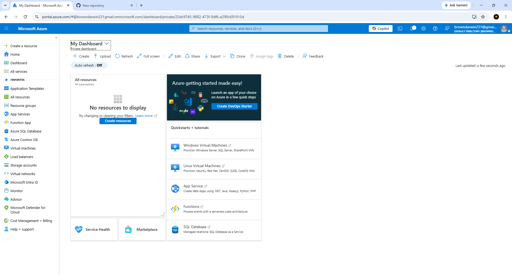
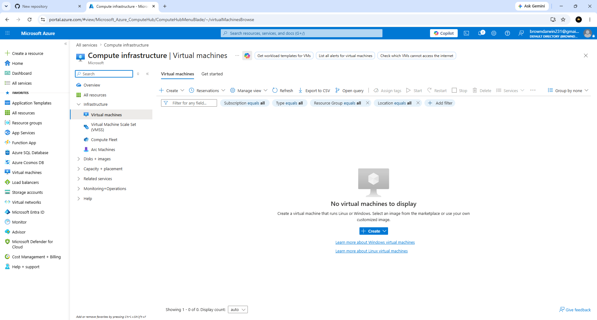
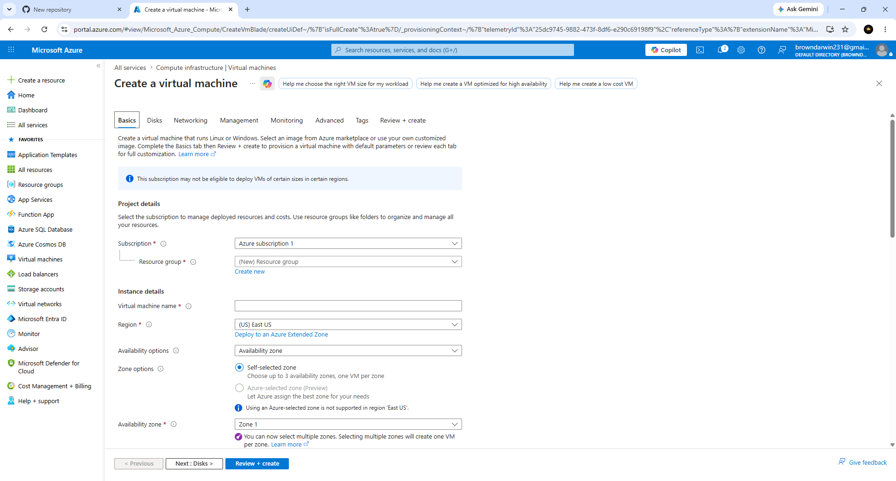
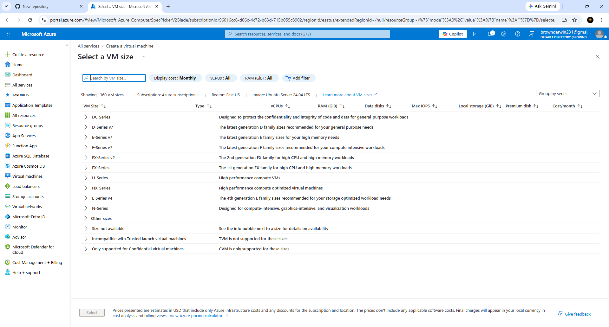
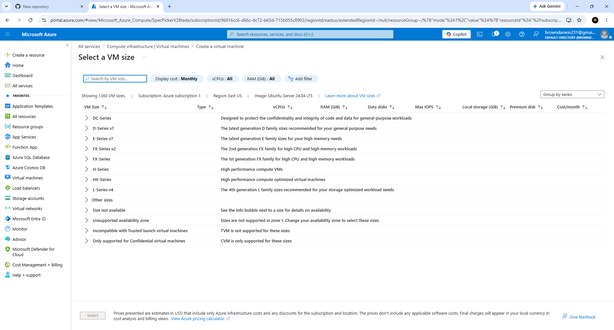

# Darwin-Azure-Virtual-Machine-Lab
Help Desk Azure Virtual Machine configuration and deployment lab.

## Overview

## Project Objectives

- Navigate the Microsoft Azure Portal
- Access the Virtual Machines service
- Configure a new Azure Virtual Machine
- Review available VM sizes
- Configure VM deployment settings
- Gain hands-on experience with Azure compute services

---

## Technologies Used

- Microsoft Azure
- Azure Virtual Machines
- Cloud Computing
- Ubuntu Server 24.04 LTS
- Azure Portal

---

## Skills Demonstrated

- Cloud Infrastructure
- Virtual Machine Deployment
- Azure Resource Management
- Azure Compute Services
- Infrastructure Configuration
- Cloud Administration
- Technical Documentation

---

# Screenshots

## 1. Azure Dashboard

Opened the Microsoft Azure Dashboard to begin creating a new Azure Virtual Machine.

---

## 2. Virtual Machines Page

Navigated to the Azure Virtual Machines service to begin provisioning a new virtual machine.

---

## 3. Create Virtual Machine

Configured the initial virtual machine settings including subscription, resource group, VM name, and deployment region.

---

## 4. Select VM Size

Reviewed available Azure Virtual Machine sizes and evaluated compute resources available for deployment.

---

## 5. Virtual Machine Configuration

Configured advanced virtual machine settings including availability options, operating system image, VM architecture, security settings, and deployment options.

---

## Outcome

This lab provided practical experience working with Microsoft Azure Virtual Machines, including resource configuration, infrastructure planning, and compute deployment. It strengthened foundational cloud administration skills that are valuable for Help Desk, IT Support, Cloud Support, and entry-level Azure Administrator roles.

Author: Darwin Brown JR.
Aspiring Help-Desk
